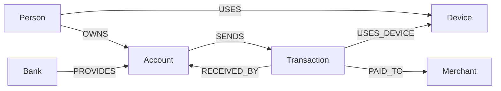
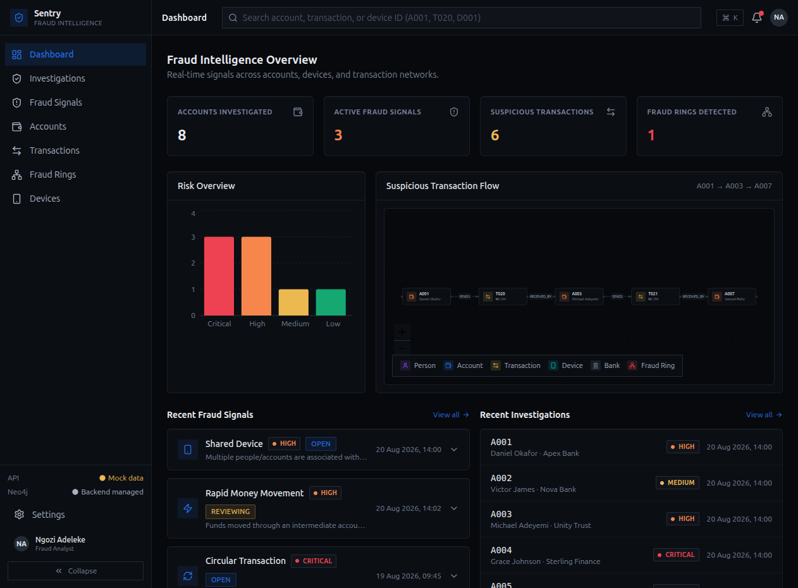
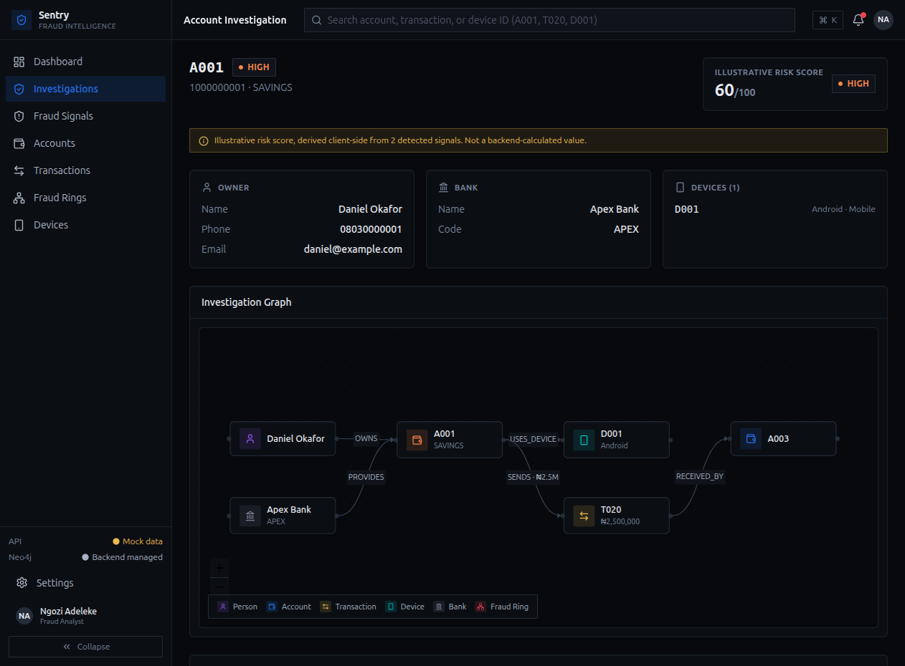

# Sentry Fraud Intelligence Platform

Sentry is a graph-powered fraud investigation application for analysts exploring
money movement, shared devices, connected accounts, and fraud rings in a Nigerian
financial-crime scenario. This repository contains the React application, FastAPI
service, CognoDB/Neo4j data-loading scripts, Cypher queries, tests, and screenshots.

**Hosted demo:** [sentry-fraud-intelligence.vercel.app](https://sentry-fraud-intelligence.vercel.app/)

The demo is configured for the hosted API. The interface includes a mock-data mode
for local UI exploration when a database is not available.

## Why A Graph Database?

Fraud is a relationship problem, not only a row problem. A graph keeps people,
accounts, banks, devices, merchants, and transactions connected, letting an analyst
follow evidence across several hops in one query. Shared-device detection, rapid
movement through an intermediary, and circular money flows are natural path
patterns in a graph and avoid many relational joins and staging tables.

## Data Model



| Label | Key properties |
| --- | --- |
| `Person` | `id`, `name`, `phone`, `email` |
| `Bank` | `id`, `name`, `code` |
| `Account` | `id`, `accountNumber`, `accountType`, `status` |
| `Device` | `id`, `fingerprint`, `deviceType`, `operatingSystem` |
| `Transaction` | `id`, `amount`, `currency`, `channel`, `status`, `timestamp` |
| `Merchant` | `id`, `name`, `category`, `status` |

## Stack

- React 18 + TypeScript + Vite
- Tailwind CSS (dark, financial/security aesthetic)
- React Router
- Axios (centralized API layer)
- React Flow (investigation graph visualization)
- Recharts (risk overview chart)
- Lucide React (icons)

## Repository Layout

```text
frontend/                 React + TypeScript + Vite application
backend/app/              FastAPI routes, services, repositories, models, and DB client
backend/app/queries/      Cypher query catalogue
backend/scripts/           CognoDB constraints, seed data, and query tests
docs/screenshots/          Product screenshots
```

## Setup

### Create The CognoDB Instance

1. Sign in to the CognoDB console and create a project.
2. Choose **Create instance**, select a region and tier, and name the instance.
3. Wait until the instance is ready and copy its Bolt URI, username, and password.
4. Create `backend/.env` using the following values. Never commit this file.

```env
COGNO_URI=bolt+s://your-instance.bravo.databases.cognodb.com
COGNO_USERNAME=cognodb
COGNO_PASSWORD=your-password
```

### Run The Backend

```bash
cd backend
uv sync
uv run python -m scripts.constraints
uv run python -m scripts.seeds
uv run uvicorn app.main:app --reload
```

The API runs at `http://127.0.0.1:8000`. Production API:
`https://fraud-detection-backend-dwgv.onrender.com`.

### Run The Frontend

```bash
npm install
cp .env.example .env
npm run dev
```

Set `VITE_API_BASE_URL` to your backend and `VITE_USE_MOCK_DATA=false` for live data.
The backend must allow the frontend origin through CORS. The deployed Vercel app is
already allowed by the hosted backend.

With `VITE_USE_MOCK_DATA=true`, the frontend runs without CognoDB and uses the sample
dataset in `src/mocks/data.ts`.

To build for production:

```bash
npm run build
npm run preview
```

## Routes

| Path | Page |
|---|---|
| `/` | Dashboard |
| `/accounts` | Account explorer |
| `/investigations` | Investigation hub (search + flagged accounts) |
| `/investigations/accounts/:accountId` | Account investigation (owner, bank, devices, transactions, graph) |
| `/transactions` | Transaction list |
| `/transactions/:transactionId` | Transaction details + flow graph |
| `/devices` | Device list |
| `/devices/:deviceId` | Device details + shared-device graph |
| `/signals` | Fraud signals feed (shared device, rapid movement, circular, etc.) |
| `/fraud-rings` | Fraud ring list |
| `/fraud-rings/:ringId` | Fraud ring investigation |
| `/settings` | Environment / connection info |

## Main Queries

The complete query catalogue is in [backend/app/queries/fraud_detection.cypher](backend/app/queries/fraud_detection.cypher),
with production execution in `backend/app/repositories/fraud_repository.py`.

- **Shared devices** groups people by connected devices and flags devices used by at least two people.
- **Rapid money movement** traverses source account, transaction, intermediary account, transaction, and destination, constrained by amount and timestamps.
- **Circular transactions** finds three-leg paths returning to the originating account and orders IDs to avoid duplicate cycles.
- **Account investigation** returns owner, bank, devices, transactions, destinations, and connected evidence for one account.

Runtime values are passed as Cypher parameters such as `$account_id`, `$account_ids`,
and `$minimum_amount`; queries are not assembled through string concatenation.

## API And Frontend Integration

Every frontend request is centralized in `src/api/fraudApi.ts`. The backend currently
exposes the core routes under `/api/fraud`, including `/dashboard`,
`/accounts/{account_id}`, `/accounts/{account_id}/network`, `/shared-devices`,
`/rapid-money-movement`, and `/circular-transactions`. The frontend also defines
expanded list and summary endpoints for the integration phase; update their path
strings in one place when those backend routes are enabled.

## Screenshots





## Validation

```bash
npm run lint
npm run build
```

## Risk Scoring

The backend does not currently return a computed `risk_score`. The UI derives an
**illustrative risk score** client-side from detected signal types
(`src/utils/riskEngine.ts`) and clearly labels it as illustrative everywhere it
appears. Once the backend exposes a real `risk_score` field, swap the relevant
call sites to use it directly instead of `computeIllustrativeScore`.

The frontend uses NGN currency formatting and responsive tables/sidebar behavior. The
API's interactive documentation is available at `/docs` on the hosted backend.
