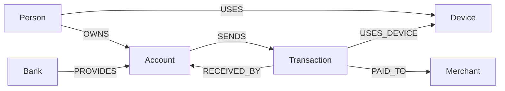

# Fraud Detection Graph

## Use case

The API helps a fraud analyst investigate suspicious movement of money across
accounts. The supplied scenario contains two realistic patterns: funds moving
rapidly through intermediary accounts, and funds completing a circular route.
Several people also use the same device, providing an independent identity
signal. The service turns these connected observations into shared-device,
rapid-money-movement, and circular-transaction risk signals.

## Why a graph database?

Fraud is usually a relationship problem rather than an isolated row problem.
Neo4j keeps the people, accounts, devices, banks, merchants, and transactions
connected, so an investigator can follow evidence across several hops in one
query. For example, the path
`Account -[:SENDS]-> Transaction -[:RECEIVED_BY]-> Account` can be repeated to
find an intermediary and a destination. Shared-device detection also links
people who have no common account, a pattern that requires several awkward
relational joins and intermediate tables.

## Data model



Nodes use stable `id` values. Important properties are:

| Label | Properties |
| --- | --- |
| `Person` | `id`, `name`, `phone`, `email` |
| `Bank` | `id`, `name`, `code` |
| `Account` | `id`, `accountNumber`, `accountType`, `status` |
| `Device` | `id`, `fingerprint`, `deviceType`, `operatingSystem` |
| `Transaction` | `id`, `amount`, `currency`, `transactionType`, `channel`, `status`, `timestamp` |
| `Merchant` | `id`, `name`, `category`, `status` |

## Setup

### Create a CognoDB instance

1. Sign in to the CognoDB console and create a new project.
2. Choose **Create instance**, select the available region and instance tier,
	 and give the instance a name.
3. Wait for the instance status to become ready, then open its connection or
	 credentials panel.
4. Copy the Bolt connection URI, username, and password. Keep the password
	 out of source control and do not commit `.env`.

Create `.env` in this project directory:

```text
COGNO_URI=bolt+s://your-instance.bravo.databases.cognodb.com
COGNO_USERNAME=cognodb
COGNO_PASSWORD=your-password
```

Install dependencies and run the constraints and seed scripts from the
`backend/` directory:

```bash
cd backend
uv sync
uv run python -m scripts.constraints
uv run python -m scripts.seeds
```

The seed data is defined in `scripts/seeds.py`. It uses `MERGE` and parameter
dictionaries, so rerunning it is idempotent.

## Run the API

From the `backend/` directory:

```bash
uv run uvicorn app.main:app --reload
```

The API is available at `http://127.0.0.1:8000`. Connectivity failures return
HTTP `503` with a retry hint rather than exposing driver or credential details.

Production backend: `https://fraud-detection-backend-dwgv.onrender.com`

API reference: `https://fraud-detection-backend-dwgv.onrender.com/docs`

## Run the frontend

The React frontend lives in the sibling `frontend/` directory. From the
repository root, install its dependencies and start Vite:

```bash
cd frontend
npm install
cp .env.example .env
npm run dev
```

Set `VITE_API_BASE_URL` in `frontend/.env` to the backend URL when using live
data. The frontend defaults to realistic mock data, so the interface can also
be explored without a running database. Open the Vite URL shown in the
terminal, normally `http://localhost:5173`.

## Main queries

The examples are catalogued in `app/queries/fraud_detection.cypher` and are
implemented through the official Neo4j Python driver in
`app/repositories/fraud_repository.py`.

- **Shared devices:** groups `Person` nodes by a connected `Device` and flags
	devices used by at least two people. This is a graph-native identity link.
- **Rapid money movement:** traverses five relationship edges from a source
	account through two transactions and an intermediary account to a
	destination. `$minimum_amount` and timestamps constrain the result.
- **Circular transactions:** traverses three transaction legs and returns to
	the starting account, while ordering account IDs to avoid duplicate cycles.
- **Account investigation:** accepts `$account_id` and returns account owner,
	bank, device, transaction, and destination context.

Every runtime query passes values as driver parameters such as `$account_id`,
`$account_ids`, and `$minimum_amount`; Cypher is never assembled by string
concatenation.

## UI screenshots

The product UI is the Sentry React fraud-intelligence frontend. The dashboard
summarises risk signals and shows connected entities; the account investigation
view combines ownership, transaction, device, and graph evidence.


The backend API reference is also available at `http://127.0.0.1:8000/docs`
and `http://127.0.0.1:8000/redoc`, but those pages are development references,
not the product UI shown above.
